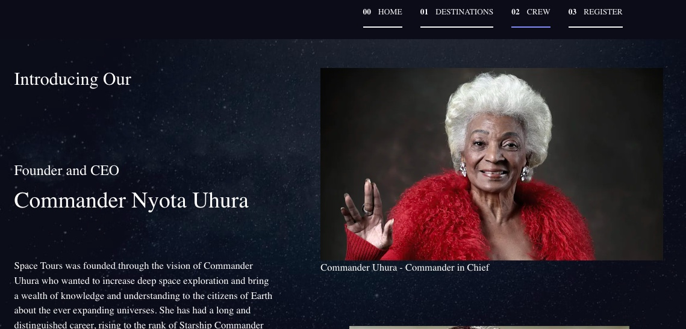

# Space-Tours-App-Project

### This is my Capstone project for Ada Developers Academy
* Uses HTML, CSS,  JS,  React, Node js,  Express and Mongo DB

### It's a space travel tours website that provides information of the several
galaxies, crew members and space crafts used
* Collects passenger data via user input 
* Stores and retrieves passenger data from the Mongo DB using an Express server 
